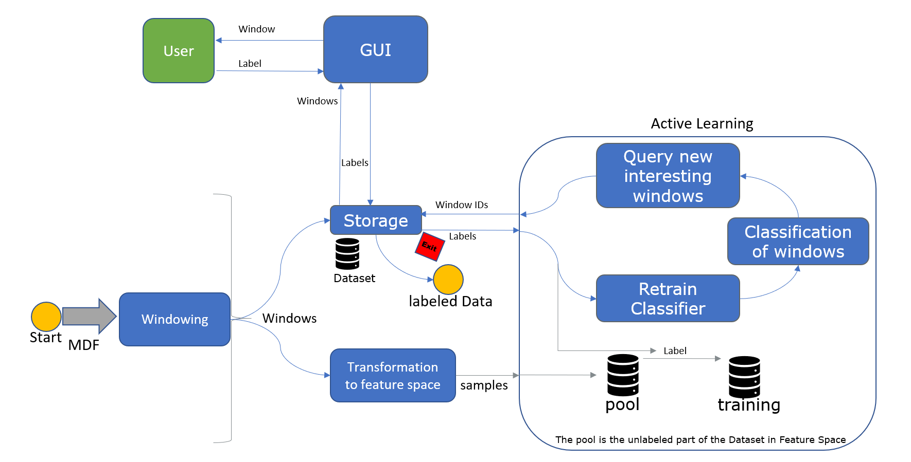

# Active-Learning-for-the-Annotation-of-Time-Series

In this folder are stored environments for an Active Learning supported Labeling of Time Series.
It is based on BOSS (Bag Of SFA Samples), ROCKET (RandOm Convolutional KErnel Transform) and modAL (Modular Active Learning framework for Python3).
This work was done as part of a master thesis at Vector Informatik GmbH.

To use one of the environment install it with:

    pip install -e <path to this folder>

Overview: 
